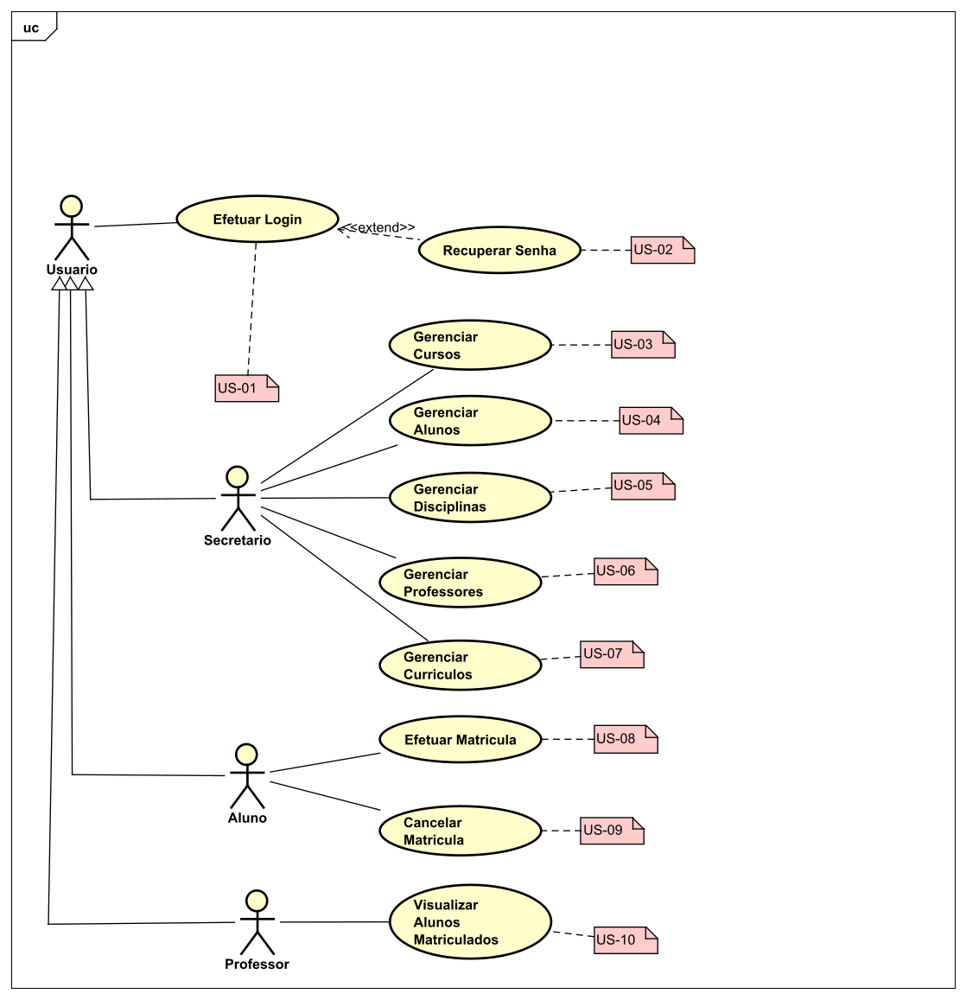
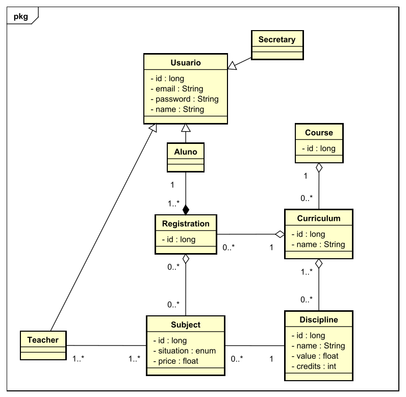
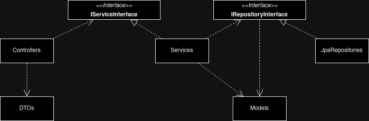

# LABORATÓRIO 01 - Sistema de Matrículas

O projeto tem como objetivo desenvolver um Sistema de Matrículas para uma universidade, informatizando todo o processo de inscrição dos alunos nas disciplinas. Esse sistema permitirá que os alunos se matriculem em disciplinas obrigatórias e optativas, respeitando limites mínimos e máximos de inscritos por disciplina. Além disso, o sistema notificará o setor de cobranças sobre as inscrições realizadas e permitirá que os professores acessem a lista de alunos matriculados. O desenvolvimento do projeto segue um cronograma estruturado, com entregas intermediárias de diagramas e um protótipo funcional, culminando na entrega final do sistema, alinhado com os modelos UML e as funcionalidades exigidas.

## Alunos integrantes da equipe

- Pedro Henrique Pires Rodrigues
- Pedro Negri Leão Lambert
- Vinicius Rezende Arantes de Araujo Moreira

## Professores responsáveis

- João Paulo Carneiro Aramuni

## Instruções de utilização

[Assim que a primeira versão do sistema estiver disponível, deverá complementar com as instruções de utilização. Descreva como instalar eventuais dependências e como executar a aplicação.]

## Histórias de Usuário

| **User Story**                        | **Descrição**                                                                                                                              |
| ------------------------------------- | ------------------------------------------------------------------------------------------------------------------------------------------ |
| US01 - Realizar Cadastro              | Eu, como usuário, quero poder realizar o cadastro para ter permissão de entrar no sistema.                                                 |
| US02 - Efetuar Login                  | Eu, como usuário, quero poder realizar o login para acessar o sistema.                                                                     |
| US03 - Recuperar Senha                | [estende US02] Eu, como usuário, quero poder recuperar minha senha para não perder acesso à minha conta caso a esqueça.                    |
| US04 - Gerenciar Cursos               | Eu, como secretário, quero poder gerenciar os cursos para manter as informações dos cursos atualizadas no sistema.                         |
| US05 - Gerenciar Alunos               | Eu, como secretário, quero poder gerenciar os alunos para organizar e manter os registros dos alunos no sistema.                           |
| US06 - Gerenciar Disciplinas          | Eu, como secretário, quero poder gerenciar as disciplinas para garantir que as informações das disciplinas estejam corretas e disponíveis. |
| US07 - Gerenciar Professores          | Eu, como secretário, quero poder gerenciar os professores para atualizar e organizar as informações dos professores no sistema.            |
| US08 - Gerenciar Currículos           | Eu, como secretário, quero poder gerenciar os currículos para estruturar e atualizar os currículos dos cursos oferecidos.                  |
| US09 - Efetuar Matrícula              | Eu, como aluno, quero poder efetuar a matrícula para me inscrever nas disciplinas desejadas.                                               |
| US10 - Cancelar Matrícula             | Eu, como aluno, quero poder cancelar a matrícula para me desinscrever de disciplinas que não desejo cursar.                                |
| US11 - Visualizar Alunos Matriculados | Eu, como professor, quero poder visualizar os alunos matriculados nas minhas disciplinas para acompanhar quem está inscrito.               |

## Diagrama de Caso de Uso

## Diagrama de Classes

## Decisões de Projeto

Além da adição comum da camada de serviços promovendo a modularizar da lógica de negócio, foi adicionada uma interface para a camada de serviço e para a camada de repositório aderindo ao princípio de inversão de dependências e o "open/closed principle". Garantindo que não haja dependências entre componentes concretos e criando pontos de extensão no código.
Além disso, o principio de Liskov é aderido considerando que as interfaces vão ser substituídas por suas subclasses durante a execução do código, sem afetar o seu funcionamento. Por último, a estrutura do sistema está de acordo com o princípio de segregação de interfaces e responsabilidade única.

